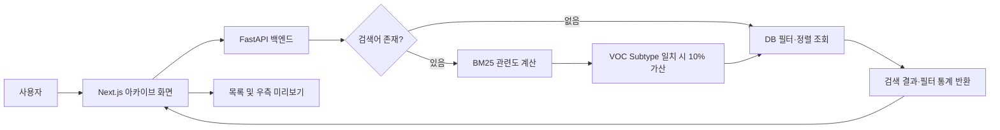

# 고객 대응 아카이브 검색 기능 설계

## 1. 목적과 범위

고객 대응 아카이브는 과거와 현재의 VOC 사례를 한 화면에서 검색하고, 핵심 내용을 빠르게 비교한 뒤 요청 상세·협업 화면으로 이동할 수 있게 한다. Top 3 추천은 완료(`closed`) 사례만 대상으로 하지만, 아카이브는 진행 상태와 관계없이 모든 사례를 기본 조회 대상으로 한다.

본 설계의 범위는 아카이브 목록, 통합 키워드 검색, 구조화 필터, 결과 미리보기, 상세 화면 이동, 검색 상태 복원이다. 신규 요청 등록, 부서 배정, 진행도 관리의 세부 구현은 별도 설계 범위로 둔다.

## 2. 확정된 검색 정책

- 통합 키워드 검색 대상은 `Customer Request + Original Mail Body + Full Response History`이다.
- 아카이브 최초 진입 시 모든 상태의 사례를 최신 접수일 순으로 표시한다.
- 검색어가 없으면 데이터베이스 필터와 정렬만 수행한다.
- 검색어가 있으면 BM25 관련도 검색을 수행한다.
- VOC Subtype이 일치하면 `BM25 × (1 + subtype_match × 0.1)` 산식으로 10%를 가산한다.
- 검색어가 있을 때 기본 정렬은 관련도 순이며, 최신순·오래된순으로 변경할 수 있다.
- 고객사가 달라도 VOC, 제품·설비, 요청 내용이 더 유사하면 높은 순위에 배치한다.
- Sentence Transformer는 기획서의 기술 검증 1안으로만 기록하며 실제 웹 구현에는 사용하지 않는다.

## 3. 화면 구성

기존 Figma 화면의 CI Blue 기반 사이드바와 헤더를 유지하고 `고객 대응 아카이브` 메뉴에서 진입한다.

### 상단 검색·필터 영역

- 통합 키워드 검색창
- 고객사
- 제품·설비
- VOC Type
- VOC Subtype
- 접수 기간
- 진행 상태
- 담당 부서
- 정렬 선택
- 필터 초기화

### 검색 결과 목록

각 결과는 Case ID, 고객사, 제품·설비, VOC Type/Subtype, 고객 요청 요약, 담당 부서, 진행 상태, 접수일을 표시한다. BM25 검색 결과에는 관련도 점수와 일치한 주요 키워드를 함께 표시한다. 결과는 페이지 단위로 조회한다.

### 우측 미리보기

선택한 결과의 고객 요청 요약, 원본 메일, 전체 대응 이력 요약, 담당 부서, 최종 상태, 첨부파일 목록을 표시한다. `상세 화면에서 보기`를 선택하면 요청 상세·협업 화면으로 이동한다. 아카이브로 돌아오면 검색어, 필터, 정렬, 페이지, 선택 사례를 복원한다.

## 4. 시스템 구조와 검색 처리 흐름

프론트엔드는 검색어, 필터, 정렬, 페이지 정보를 백엔드에 전달한다. 백엔드는 입력값과 조회 권한을 검증한 뒤 검색어 유무에 따라 DB 조회 또는 BM25 검색을 수행한다. 구조화 필터는 BM25 후보군을 먼저 줄이는 조건으로 적용한다. 결과에는 사례 데이터, 관련도 점수, 일치 키워드, 페이지 정보가 포함된다.

운영 환경은 Supabase PostgreSQL, 사내 로컬 환경은 일반 PostgreSQL을 사용하며 연결 설정만 교체한다. 사례가 등록·수정·종결되면 해당 사례의 BM25 검색 문서를 갱신하고, 매 요청마다 전체 데이터를 재처리하지 않는다.

## 5. 데이터 구성

검색과 결과 표시에 사용하는 핵심 데이터는 다음과 같다.

- Case ID, 고객사, 국가
- 제품·설비
- VOC Type/Subtype, Priority
- Customer Request, Original Mail Body
- Responsible Dept., Received, Final Status
- Full Response History
- 첨부파일 메타데이터

검색용 문서는 고객 요청, 원본 메일, 전체 대응 이력을 결합한다. 빈 값은 빈 문자열로 처리하며 HTML 태그, 메일 서명, 반복 공백처럼 검색을 방해하는 요소만 제거한다. 원본 데이터는 변경하지 않고 검색용 정제 문서를 별도로 관리한다.

## 6. 예외 처리

- 결과가 없으면 검색 조건 변경과 필터 초기화를 안내한다.
- BM25 처리에 실패하면 일반 DB 키워드 검색으로 임시 전환하고 오류를 기록한다.
- DB 연결에 실패하면 재시도 안내를 표시하고 검색어와 필터 상태를 보존한다.
- 삭제되었거나 조회 권한이 없는 사례는 목록과 미리보기에서 제외한다.
- 긴 원본 메일과 대응 이력은 미리보기에서 일부만 표시하고 상세 화면에서 전체를 제공한다.

## 7. 검증 기준

- 검색·아카이브 데이터 135건과 독립 검증 데이터 15건을 사용한다.
- BM25 산출 점수와 VOC Subtype 가산 전후 순위를 기록한다.
- 담당자가 Top 3의 VOC, 제품·설비, 요청 내용, 대응 이력 유사성을 직접 평가한다.
- 검색어 없음·있음, 단일·복합 필터, 정렬 변경, 페이지 이동을 검증한다.
- 결과 선택, 우측 미리보기, 상세 이동, 아카이브 복귀 후 상태 복원을 검증한다.
- Supabase PostgreSQL과 로컬 PostgreSQL에서 동일한 필터·정렬·검색 결과 형식을 확인한다.

## 8. 구현 전제

현재 작업 폴더에는 전처리·DB 적재 자료와 기획 문서만 있으며 웹 애플리케이션 소스는 없다. 본 설계 승인 후 Next.js 프론트엔드, FastAPI 백엔드, PostgreSQL/Supabase 연결 구조를 신규 프로젝트로 구현한다.
