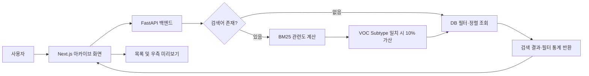

# 고객 대응 플랫폼 프로젝트 기획서

## Executive Summary

본 프로젝트는 고객 메일로 접수되는 VOC(Voice of Customer)를 구조화하고, 과거 대응 사례 중 업무적으로 참고할 수 있는 유사 사례 Top 3를 제시하여 고객 대응 담당자의 초기 판단과 유관부서 협업을 지원하는 것을 목표로 한다.

현재까지 대외비 보호를 위해 실제 업무 패턴을 바탕으로 재구성한 시뮬레이션 VOC 150건을 구축하고, 데이터베이스용 135건과 독립 검증용 15건으로 분리하였다. 다국어 Sentence Transformer를 활용한 벡터 검색과 BM25 키워드 검색을 각각 검증했으며, 현재 자료에서는 BM25가 핵심 업무 키워드를 중심으로 사례를 구분하는 데 더 실용적인 결과를 보였다. 다음 개선안으로 VOC Subtype 일치 사례에 10% 가점을 부여하는 점수 보정 방식을 설계하였다.

웹 협업 플랫폼은 업무 흐름과 Figma 기반 주요 화면 구성을 설계한 상태다. 누락되었던 아카이브 검색 화면의 요구사항과 처리 흐름도 추가로 확정했으며, 다음 단계에서 Codex를 활용해 Next.js와 FastAPI 기반으로 구현할 예정이다. 따라서 본 문서는 데이터·검색 프로토타입의 실제 완료 범위와 웹 플랫폼의 설계·향후 구현 범위를 명확히 구분한다.

---

## 1. 프로젝트 개요 및 목적

### 1.1 현업 문제

고객 요청은 대부분 메일과 같은 비정형 문장으로 접수된다. 담당자는 고객사, 제품, 요청 유형, 회신 기한, 필요한 조치를 메일에서 직접 파악해야 하며, 유사한 과거 사례를 찾기 위해 기존 메일과 대응 이력을 수작업으로 검색해야 한다. 또한 여러 유관부서가 동시에 대응하는 경우 부서별 진행 상태와 회신 내용을 한눈에 확인하기 어렵다.

이로 인해 다음 문제가 발생한다.

- 과거 유사 사례 검색에 시간이 오래 걸린다.
- 담당자의 경험에 따라 대응 방향과 유관부서 선정이 달라질 수 있다.
- 고객 요청, 부서별 조치, 회신 및 종결 이력이 여러 위치에 분산된다.
- 대응 기한과 지연 사유를 지속적으로 추적하기 어렵다.

### 1.2 최종 목표

고객 메일을 입력하면 핵심 정보를 확인·보정하고, 완료된 과거 VOC 중 유사 사례 Top 3를 조회한 뒤, 관련 부서에 업무를 배정하고 종결까지 진행 상황을 관리하는 협업 플랫폼을 구축한다.

최종 사용자는 다음 업무를 수행할 수 있다.

1. 고객 메일을 붙여넣어 고객사·제품·VOC 유형·요청 내용을 확인한다.
2. 유사한 과거 VOC Top 3와 당시 대응 부서를 참고한다.
3. 하나의 요청을 제조·기술·정비·품질 등 여러 부서에 병렬로 배정한다.
4. 부서별 대응 내용, 첨부파일, 마감일 및 진행 상태를 관리한다.
5. 고객 회신 이후 추가 문의가 오면 기존 이력을 보존한 채 재접수한다.
6. 종결된 요청을 고객사·제품·요청 유형·날짜별로 검색한다.

---

## 2. 전체 시스템 구성

최종 시스템은 사용자가 메일을 입력하는 프론트엔드, 입력값을 검증하고 검색을 수행하는 백엔드, VOC와 진행 이력을 보관하는 데이터베이스, 유사 사례를 산출하는 검색 알고리즘으로 구성한다.

### 구성 요소별 역할

- **프론트엔드:** 고객 메일 입력, 추출 정보 확인, Top 3 결과 조회, 부서 배정, 진행도 관리, 아카이브 검색을 제공한다.
- **백엔드:** 입력값 검증, 텍스트 정제, 검색용 데이터 구성, BM25 실행, 결과 반환, 업무 상태 및 이력 저장을 담당한다.
- **데이터베이스:** VOC 원문·요약·분류·고객사·담당부서·처리 이력과 신규 요청의 부서별 진행 정보를 저장한다.
- **검색 알고리즘:** 현재는 BM25 키워드 검색을 운영 후보로 두고, Sentence Transformer 벡터 검색 결과를 비교 검토 자료로 활용한다.

### 현재 단계

- 데이터 구성 및 검색 프로토타입: 구현·검증 완료
- BM25 Subtype 가점 방식: 산식 설계 완료, 최종 데이터 기준 검증 예정
- Supabase: 적재용 데이터 준비 완료, 실제 적재 예정
- 웹 화면·업무 흐름: Figma 기반 주요 화면 및 아카이브 검색 설계 완료
- Next.js·FastAPI 애플리케이션: 향후 구현 예정

### 아카이브 검색 시스템 구조와 처리 흐름

아카이브는 진행 상태와 관계없이 모든 고객 대응 사례를 기본 조회 대상으로 하며, 검색어가 없을 때는 최신 접수일 순으로 표시한다. 검색어가 있으면 고객 요청 내용, 원본 메일, 전체 대응 이력을 결합한 검색 문서에 BM25를 적용하고, VOC Subtype 일치 사례에는 10% 가산점을 부여한다.



프론트엔드는 검색어, 고객사, 제품·설비, VOC Type/Subtype, 접수 기간, 진행 상태, 담당 부서, 정렬, 페이지 정보를 백엔드로 전달한다. 백엔드는 입력값과 조회 권한을 검증한 뒤 검색어 유무에 따라 DB 조회 또는 BM25 검색을 수행한다. 운영 환경은 Supabase PostgreSQL, 로컬 환경은 일반 PostgreSQL을 사용하며 연결 설정만 교체한다.

---

## 3. 프론트엔드

프론트엔드는 Next.js 기반으로 구현할 계획이다. 현재 실행 가능한 소스코드는 없으며, Figma를 통해 사용자 흐름과 주요 화면 구성을 설계한 상태다. 누락되었던 아카이브 검색 화면 설계까지 확정했으며, Codex를 활용해 구현할 예정이다.

### 계획된 주요 화면

- **대시보드:** 내 미완료·마감 임박 업무, 전체 부서별 진행·지연 현황, 신규 접수·미배정 요청을 동일 비중으로 표시한다.
- **새 요청 등록:** 메일 원문 붙여넣기, 임시 저장, 자동 추출값 수정·확정, 검색 실행을 제공한다.
- **유사 사례 결과:** Top 3 사례의 VOC Type/Subtype, 고객사, 제품, 대응 부서 및 선정 근거를 표시한다.
- **고객 대응 관리:** 신규, 진행 중, 검토 대기, 고객 회신, 지연, 종결 상태별로 요청을 관리한다.
- **고객 대응 아카이브:** 고객 요청 내용·원본 메일·전체 대응 이력을 통합 검색하고, 고객사·제품/설비·VOC Type/Subtype·날짜·상태·담당 부서로 필터링한다. 모든 상태를 기본 표시하며, 검색어가 있으면 BM25 관련도 순, 없으면 최신 접수일 순으로 정렬한다. 결과 목록에서 우측 미리보기를 확인한 뒤 요청 상세 화면으로 이동할 수 있다.
- **요청 상세:** 부서별 담당자·기한·진행 상태, 고객 회신, 첨부파일, 변경 이력을 관리한다.
- **알림:** D-2, D-1 및 기한 초과 업무를 플랫폼 알림과 이메일로 안내한다.

공통 업무 단계는 `요청 접수 → 대응 중 → 부서별 검토 요청 → 선택적 직책자 검토 → 고객 회신 → 완료(종결)`로 설계하였다. 단계는 앞뒤로 이동할 수 있으며, 고객 회신 후 추가 질문이 오면 사유를 남기고 요청 접수 단계로 되돌린다.

---

## 4. 백엔드

백엔드는 FastAPI 기반으로 구현할 계획이다. 입력 데이터의 형식을 검증하고 검색 알고리즘 및 PostgreSQL 계열 DB와 연결하기에 적합하며, API 구조를 명확하게 관리할 수 있기 때문이다. 현재 백엔드 소스코드는 없으므로 다음 내용은 구현 설계 범위다.

### 계획된 처리 역할

1. 프론트엔드에서 고객 메일과 사용자 확정 정보를 전달받는다.
2. 필수 입력값과 데이터 형식을 검증한다.
3. 검색에 사용할 텍스트와 필터 조건을 구성한다.
4. 완료된 과거 VOC를 대상으로 BM25 검색을 수행한다.
5. Top 3 사례와 점수·선정 근거를 프론트엔드에 반환한다.
6. 신규 요청, 부서 배정, 진행 상태, 고객 회신 및 변경 이력을 DB에 저장한다.

관리자 기능이 크게 확대되면 Django, 경량 서비스 분리가 필요하면 Flask를 재검토할 수 있으나, 1차 구현 기준은 FastAPI다.

---

## 5. 데이터베이스

운영 후보 DB는 Supabase가 제공하는 PostgreSQL이며, 로컬 개발·통합 테스트에는 Docker 기반 PostgreSQL을 사용할 계획이다. 두 환경에서 동일한 데이터 구조와 검색 결과가 유지되는지를 확인한다.

현재 확인된 완료 범위는 Supabase 업로드용 CSV 및 384차원 벡터 데이터 준비까지다. 실제 운영 테이블 적재와 웹 애플리케이션 연동은 향후 수행한다.

### 핵심 데이터 구조

- **VOC 사례:** Case ID, 고객사, 국가, VOC Type/Subtype, 우선순위, 고객 요청, 원문 메일, 담당 부서, 처리 일자, 최종 상태, 전체 대응 이력
- **신규 고객 요청:** 사용자가 등록한 메일과 확정된 고객사·제품·VOC 정보
- **부서 배정:** 하나의 고객 요청과 여러 유관부서를 연결하는 병렬 업무 정보
- **진행 이력:** 상태 변경, 대응 내용, 첨부파일, 변경 사유, 등록자와 등록 시각
- **기준정보:** 사용자, 부서, VOC Type/Subtype

---

## 6. 데이터 구성 및 전처리

### 6.1 원본 데이터

실제 고객 메일은 대외비 문제로 직접 사용하지 않았다. 실제 업무에서 발생하는 고객사·제품·VOC 유형·요청·처리 흐름을 참고해 시뮬레이션 VOC 150건을 재구성하였다. 데이터는 Complaint 52건, Request 50건, Inquiry 48건으로 구성되어 있으며 한국어·영어·중국어·일본어·독일어 원문을 포함한다.

최종 데이터는 DB용 135건과 독립 Test용 15건으로 분리하였다. Test 데이터는 Complaint·Request·Inquiry 각 5건으로 구성해 업무 유형별 결과를 균형 있게 확인할 수 있도록 했다. 두 집합의 Case ID는 중복되지 않는다.

### 6.2 주요 컬럼과 의미

- **Case ID:** 사례를 구분하는 유일 식별자
- **Customer name / Country:** 고객사와 국가
- **VOC Type / Subtype:** Complaint·Request·Inquiry 및 세부 이슈 분류
- **Priority:** Critical·High·Medium·Low 우선순위
- **Customer Request:** 고객 요청의 배경·요청사항·회신 기한을 한국어로 요약한 텍스트
- **Original Mail Body:** 고객사 국가에 맞는 다국어 메일 원문
- **Responsible Dept.:** 과거 사례의 대응 부서
- **Received ~ 6D Result:** 접수, 초기 회신, 임시 조치, 원인·시정조치, 고객 회신 및 효과 검증 정보
- **Final Status / Delay:** 종결·진행·고객 대기 상태와 지연 단계·사유
- **Full Response History:** 접수부터 종결까지의 처리 과정을 시간순으로 정리한 통합 이력

### 6.3 실제 수행한 처리

1. **업무 유형 구조화:** 메일을 Complaint·Request·Inquiry와 Subtype으로 구분했다. 유형에 따라 대응 절차가 다르므로 검색 결과의 업무 적합성을 확인하기 위해 필요했다.
2. **요청 내용 요약:** 다국어 원문에서 배경, 핵심 요청, 회신 기한을 한국어 `Customer Request`로 구성했다. 긴 메일에서 검색에 필요한 업무 표현을 집중시키기 위한 처리다.
3. **처리 이력 통합:** 단계별 날짜와 조치 내용을 `Full Response History`로 시간순 결합했다. 유사 사례 검색 시 단순 이슈뿐 아니라 대응 맥락을 함께 반영하기 위해 사용했다.
4. **DB 컬럼명 정리:** Supabase 업로드 파일의 컬럼명을 snake_case 형태로 변환했다. DB에서 일관된 이름으로 관리하기 위한 처리다.
5. **빈 행 제외:** Case ID와 검색 데이터가 없는 빈 행은 검색 대상에서 제외했다.
6. **임베딩 변환:** 고객 요청 요약, 원문 메일, Full Response History를 하나의 검색 문서로 결합하고 다국어 Sentence Transformer 사전학습 모델로 384차원 벡터를 생성했다. DB용 데이터와 Test 데이터에는 동일한 모델을 적용했다.
7. **BM25 검색 텍스트 구성:** VOC Type, Subtype, Customer Request를 검색 입력으로 사용했다. 한·영문 소문자화, 구분자 제거, 핵심 복합어 유지, 불용어 제외를 적용해 업무 키워드가 점수에 반영되도록 했다.

별도의 수치 표준화, 시계열 Window 구성, 모델 재학습, 결측치 임의 대체는 수행하지 않았다. Containment·5D·6D 등 일부 공란은 VOC 유형이나 진행 상태에 따라 해당 단계가 존재하지 않는 구조적 공란이므로 일괄 보간하지 않았다.

### 6.4 최종 모델 입력

- Sentence Transformer: `Customer Request + Original Mail Body + Full Response History` 결합 문장 → 384차원 벡터
- BM25: `VOC Type + VOC Subtype + Customer Request` 정제 토큰 → 문서별 BM25 점수

---

## 7. AI 모델 및 핵심 알고리즘

### 7.1 1안: Sentence Transformer 벡터 매칭

직접 학습한 모델이 아니라 다국어 Sentence Transformer 사전학습 모델을 활용하였다. 한국어·영어·중국어·일본어·독일어처럼 표현 언어가 달라도 문장의 의미와 처리 맥락을 비교하기 위해 선택했다.

VOC 텍스트를 384차원 벡터로 변환한 뒤 Test 벡터와 DB 벡터 사이의 코사인 유사도를 계산하고, 점수가 높은 사례 3건을 추천하였다. 벡터 검색은 의미적으로 가까운 사례를 찾는 장점이 있었지만, 일부 결과에서 업무 유형이나 핵심 키워드의 구분력이 부족했다.

### 7.2 2안: BM25 키워드 매칭

BM25는 문서 안의 단어 빈도와 전체 DB에서 해당 단어가 얼마나 드문지를 함께 반영하는 검색 알고리즘이다. 고객 요청에 포함된 제품명, 세부 이슈, 요청 행동 등 명시적인 업무 키워드를 구분하기 위해 사용하였다.

- 입력: VOC Type, Subtype, Customer Request
- 파라미터: `k1=1.5`, `b=0.75`
- 출력: 각 과거 사례의 상대 BM25 점수와 Top 3
- 결과 해석: BM25 점수는 정확도가 아니라 동일 검색 내 후보 순위를 비교하는 상대 점수

현재 비교 결과에서는 BM25가 핵심 키워드와 동일 업무 유형 중심으로 사례를 정렬하는 데 더 실용적인 것으로 판단하였다.

### 7.3 3안: 결과 점수 보정

BM25의 키워드 변별력을 유지하면서 동일 VOC 업무 유형 사례를 우선 배치하기 위해 다음 가점 방식을 설계하였다.

`최종 점수 = BM25 점수 × (1 + SubtypeMatch × 0.10)`

SubtypeMatch는 Test VOC와 과거 사례의 VOC Subtype이 같으면 1, 다르면 0이다. 동일 세부 유형 사례에는 10% 가점이 적용된다. 이 산식은 설계 완료 상태이며 최종 DB 135건과 Test 15건을 기준으로 재검증할 예정이다.

### 7.4 검증 방식과 한계

Test 15건에 대해 Top 3 사례를 산출하고, VOC Type/Subtype, 제품 또는 Grade, 고객 요청 행동, 대응 이력과 담당 부서의 유사성을 사람이 정성적으로 검토하였다.

현재 BM25 점수는 상대 유사도 점수이며 공식 정확도 지표가 아니다. 사람이 각 추천 사례를 적합·부적합으로 판정한 정답 데이터가 없으므로 Accuracy, Precision 또는 Top-3 적중률은 아직 산출하지 않았다. 향후 담당자 평가를 기록해 공식 Top-3 적중률을 계산할 계획이다.

---

## 8. 핵심 기능

### 현재 구현·검증된 기능

1. **시뮬레이션 VOC 데이터 구성:** 실제 업무 패턴을 150건의 구조화된 다국어 VOC로 재구성했다.
2. **DB/Test 분리:** DB용 135건과 검증용 15건을 중복 없는 Case ID로 분리했다.
3. **다국어 벡터 변환:** 결합 텍스트를 384차원 벡터로 변환해 의미 유사도 기반 Top 3를 산출했다.
4. **BM25 Top 3 검색:** 핵심 키워드 기반 점수를 계산하고 사례별 선정 근거를 정리했다.
5. **검색 방식 비교:** 벡터 검색과 BM25 결과의 업무 적합성을 비교했다.

### 설계 완료·구현 예정 기능

6. **BM25 Subtype 가점:** 동일 VOC Subtype에 10% 가점을 적용하는 최적화 산식 검증
7. **웹 협업 플랫폼:** 메일 입력, Top 3 조회, 다중 부서 배정, 진행 관리, 알림, 종결·재접수 및 아카이브

---

## 9. 현재 구현 현황 및 향후 계획

### 완료

- 시뮬레이션 VOC 150건 및 22개 핵심 컬럼 구성
- 최종 DB 135건·Test 15건 분리
- 이전 데이터 기준 다국어 384차원 임베딩과 벡터 검색 결과 생성
- BM25 키워드 검색 및 Top 3 결과 생성
- 검색 결과 정성 비교와 선정 근거 정리
- Supabase 업로드용 CSV·벡터 데이터 준비
- 웹 플랫폼 업무 흐름·화면 기본 구성 설계

### 개선·검증 중

- 최종 DB 135건 기준 검색 결과 재검증
- BM25 Subtype 일치 10% 가점 산식 검증
- 사람이 판정한 Top-3 적중률 평가 기준 마련
- Figma 기반 UI 설계 결과의 Codex 구현 전환

### 미구현

- Supabase 실제 운영 테이블 적재와 연동 검증
- Next.js 프론트엔드
- FastAPI 백엔드 및 BM25 검색 연결
- 로그인·권한·부서 배정·진척·알림·첨부파일 기능
- Docker 로컬 통합 환경 및 QA
- GitHub/Vercel 등 실제 배포

---

## 10. 전체 시스템 흐름

```text
재구성 시뮬레이션 VOC 150건
  → DB 135건 / Test 15건 분리
  → 다국어 원문·한글 요청 요약·처리 이력 정리
  → Sentence Transformer 벡터 또는 BM25 검색 입력 구성
  → 검색 방식 비교 및 Top 3 결과 검토

[향후 웹 플랫폼]
사용자 메일 입력
  → Next.js 화면에서 추출 정보 확인·수정
  → FastAPI 입력 검증·텍스트 전처리
  → PostgreSQL/Supabase의 완료 VOC 조회
  → BM25 및 Subtype 가점으로 Top 3 산출
  → 결과를 사용자 화면에 표시
  → 다중 부서 배정·진척 관리·고객 회신
  → 종결 또는 재접수 이력 저장
```

## 결론

본 프로젝트는 고객 대응 플랫폼 전체를 한 번에 구현하기보다, 먼저 대외비를 보호한 시뮬레이션 VOC 데이터와 유사 사례 검색 프로토타입을 구축해 핵심 가능성을 검증하였다. 벡터 검색과 BM25를 비교한 결과, 현재 데이터에서는 업무 키워드를 직접 반영하는 BM25가 실무 적용 후보로 적합했다. 다음 단계에서는 Subtype 가점 산식을 최종 데이터로 재검증하고, Figma로 설계한 UI를 Next.js·FastAPI·PostgreSQL/Supabase 구조로 구현해 검색 결과를 실제 부서 협업과 종결 관리까지 연결한다.
